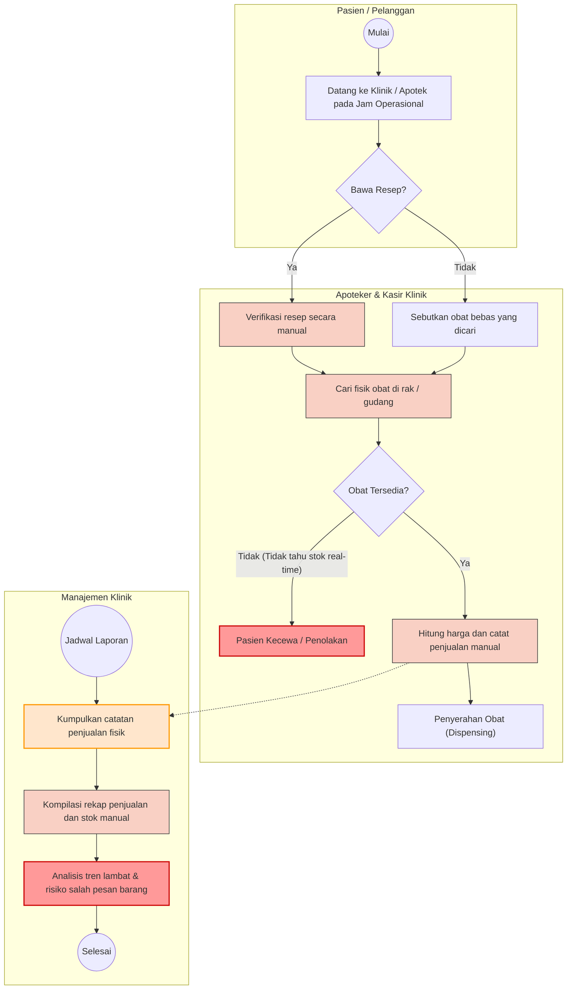

# 1. BRD (Business Requirements Document)

## 1.1 Pendahuluan

Klinik Makmur Jaya adalah sebuah klinik kesehatan yang berlokasi di kota besar di Indonesia dan menyediakan layanan konsultasi medis serta penjualan obat-obatan kepada pasien. Klinik ini melayani rata-rata 150–200 pasien per hari dengan inventaris yang masif, mencapai lebih dari 2.000 jenis obat dari berbagai kategori, meliputi obat resep, obat bebas, suplemen, dan alat kesehatan.

Saat ini, operasional penjualan obat di klinik menghadapi berbagai kendala karena masih mengandalkan proses manual dan ketiadaan platform digital. Hal ini tidak hanya membatasi akses pasien terhadap layanan farmasi di luar jam operasional, tetapi juga memicu inefisiensi dalam manajemen persediaan dan pelaporan. Sebagai langkah strategis untuk menyelesaikan permasalahan tersebut, manajemen Klinik Makmur Jaya memutuskan untuk menginisiasi pembangunan sistem e-commerce penjualan obat berbasis web. Sistem ini dirancang untuk mendigitalkan seluruh proses transaksi, pengelolaan inventaris real-time, dan memperluas jangkauan layanan melalui pembelian daring.

---

## 1.2 Identifikasi Masalah

1. Proses penjualan obat saat ini masih dilakukan secara manual, yang memicu ketidakteraturan dalam pencatatan transaksi dan berisiko menimbulkan kesalahan pelayanan kepada pasien.
2. Tidak tersedianya platform berbasis web untuk pembelian daring membatasi akses pasien terhadap layanan farmasi terutama ketika berada di luar jam operasional klinik.
3. Ketiadaan sistem pemantauan stok secara real-time berpotensi menyebabkan keterlambatan pengisian ulang (restock), kekurangan stok obat, atau kelebihan persediaan yang berdampak pada inefisiensi.
4. Proses pelaporan penjualan tidak terintegrasi, membuat manajemen kesulitan dalam menganalisis tren penjualan dan merumuskan keputusan strategis terkait pengadaan obat.
5. Proses verifikasi resep dokter yang masih berjalan secara manual memakan waktu lama dan meningkatkan risiko terjadinya kesalahan pemberian obat (dispensing).

---

## 1.3 Tujuan & Kriteria Keberhasilan

1. Menyediakan platform e-commerce yang memungkinkan pembelian obat secara daring lengkap dengan fitur keranjang belanja, checkout, dan konfirmasi pembayaran.
2. Mengimplementasikan sistem manajemen inventaris real-time dengan algoritma FIFO otomatis yang mampu memberikan peringatan dini ketika stok mencapai batas minimum atau mendekati masa kadaluarsa (90, 60, dan 30 hari).
3. Mendigitalkan dan mengotomatisasi proses verifikasi resep dokter untuk mempercepat waktu layanan dan meminimalkan risiko kesalahan dispensing.
4. Menyediakan dashboard pelaporan dan monitoring real-time bagi manajemen yang menampilkan data interaktif terkait penjualan (harian/mingguan/bulanan), ketersediaan stok, dan pendapatan.
5. Menciptakan sistem yang aman dengan perlindungan terhadap serangan siber (SQL Injection, XSS, CSRF), autentikasi multi-level, dan pencatatan aktivitas pengguna melalui audit log.

---

## 1.4 Profil Pengguna

1. **Admin**: Bertanggung jawab untuk mengelola sistem keamanan, memantau dashboard log error, menerima notifikasi error/exception aplikasi, dan melihat seluruh aktivitas pengguna melalui audit log.

2. **Apoteker**: Bertanggung jawab mengelola stok obat, menerima notifikasi otomatis ketika ada pesanan baru masuk atau obat yang mendekati tanggal kadaluarsa, serta melakukan verifikasi resep dokter secara sistem.

3. **Kasir**: Bertugas menangani transaksi penjualan secara langsung (counter) yang stoknya tersinkronisasi secara real-time dengan sistem penjualan online.

4. **Pasien/Pelanggan**: Pengguna akhir yang dapat melakukan registrasi, mencari obat pada katalog, mengelola keranjang belanja, melakukan checkout pesanan, serta menerima notifikasi status pesanan (dikonfirmasi, diproses, siap diambil, atau dikirim).

---

## 1.5 AS-IS Business Process

