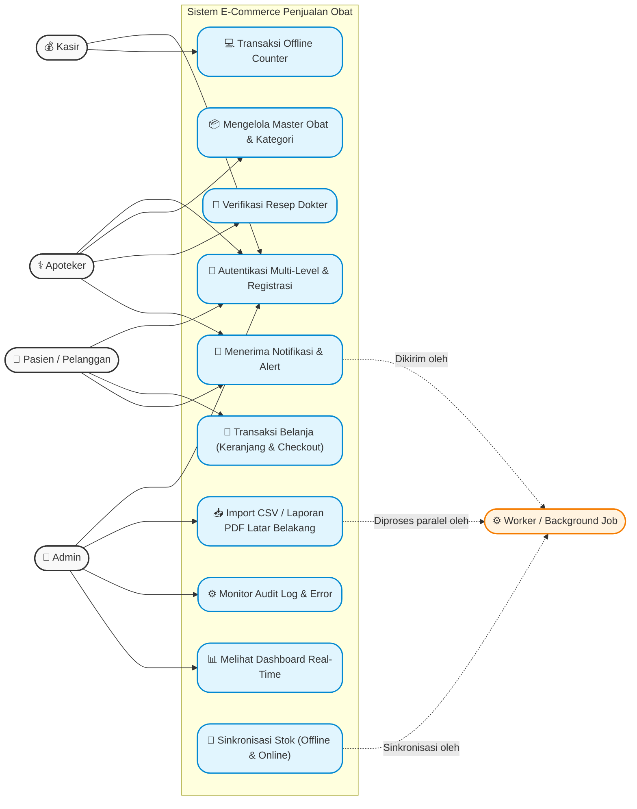
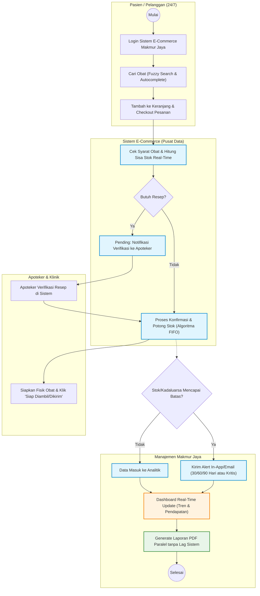

# 2. SRS (Software Requirements Specification)

## 2.1 Deskripsi Umum Aplikasi

Sistem ini dirancang untuk mendigitalkan seluruh proses pelayanan farmasi dan penjualan pada Klinik Makmur Jaya. Platform ini dibangun untuk memfasilitasi transaksi harian yang mencapai 150–200 pasien serta mengelola inventaris dalam skala besar yang mencakup lebih dari 2.000 jenis obat.

Aplikasi ini akan menggunakan arsitektur web modern yang mendukung pemrosesan data secara paralel, sistem manajemen basis data yang mengutamakan integritas dengan perlindungan terhadap serangan siber (SQL Injection, XSS, CSRF), serta kemampuan sinkronisasi real-time antara transaksi di klinik secara fisik dengan transaksi online.

---

## 2.2 Kebutuhan Fungsional

### Modul 1: Autentikasi dan Keamanan

1. Sistem login dengan autentikasi multi-level (Admin, Apoteker, Kasir, Pasien/Pelanggan)
2. Sistem registrasi pelanggan dengan verifikasi email dan validasi data diri
3. Implementasi password hashing (bcrypt/argon2) dan validasi kekuatan password
4. Proteksi terhadap serangan SQL Injection, XSS, dan CSRF
5. Sistem session management dengan timeout otomatis
6. Audit log untuk mencatat seluruh aktivitas pengguna (siapa, kapan, melakukan apa)
7. Dokumen analisis risiko keamanan informasi beserta langkah mitigasi

---

### Modul 2: Dashboard dan Real-Time Monitoring

1. Dashboard utama dengan grafik dan chart interaktif menampilkan ringkasan penjualan harian/mingguan/bulanan, stok obat, dan pendapatan
2. Katalog obat berbasis web dengan fitur pencarian, filter kategori (obat resep, obat bebas, suplemen, alat kesehatan), dan sorting harga
3. Halaman detail produk dengan informasi lengkap: nama obat, deskripsi, komposisi, dosis, efek samping, harga, dan ketersediaan stok
4. Galeri produk dengan fitur upload dan preview gambar obat (multimedia)
5. Real-time notification ketika ada perubahan stok kritis atau pesanan baru masuk
6. Export laporan penjualan dalam format PDF dengan elemen visual (logo klinik, grafik, tabel berwarna)

---

### Modul 3: Manajemen Data dan Transaksi (CRUD + SQL)

1. CRUD lengkap untuk data: Obat, Kategori Obat, Supplier, Pelanggan, Transaksi Penjualan, dan Resep
2. Implementasi query SQL untuk laporan penjualan, stok terlaris, obat mendekati kadaluarsa, dan rekap transaksi
3. Algoritma pencarian obat dengan fitur autocomplete dan fuzzy search
4. Algoritma perhitungan stok otomatis berbasis FIFO (First In First Out) untuk mengelola obat berdasarkan tanggal kadaluarsa
5. Pagination, sorting, dan filtering data dengan performa optimal
6. Fitur keranjang belanja (cart): tambah, hapus, ubah jumlah, dan hitung total harga
7. Proses checkout dengan pilihan metode pembayaran dan konfirmasi pesanan
8. Sistem verifikasi resep dokter untuk obat-obatan yang memerlukan resep

---

### Modul 4: Sistem Notifikasi dan Alert

1. Alert otomatis ketika stok obat di bawah minimum threshold (email dan/atau in-app notification)
2. Notifikasi otomatis kepada apoteker ketika ada obat mendekati tanggal kadaluarsa (30/60/90 hari sebelumnya)
3. Notifikasi kepada pelanggan terkait status pesanan (dikonfirmasi, diproses, siap diambil/dikirim)
4. Notifikasi error/exception pada aplikasi yang dikirim ke admin
5. Dashboard log error dengan kategorisasi severity (critical, warning, info)

---

### Modul 5: Pemrosesan Paralel dan Manajemen Pesanan

1. Fitur pemrosesan pesanan secara paralel sehingga beberapa pesanan dapat diproses bersamaan tanpa bottleneck pada sistem
2. Batch import data obat dari file CSV/Excel dengan proses paralel untuk pembaruan katalog
3. Background job untuk generate laporan penjualan besar tanpa mengganggu respons UI
4. Implementasi job queue untuk pemrosesan pembayaran dan update stok secara otomatis
5. Sinkronisasi stok real-time antara penjualan di counter (offline) dan penjualan online

---

## 2.3 Kebutuhan Non-Fungsional

1. **Arsitektur & Server**: Penentuan spesifikasi minimum terkait Prosesor, RAM, Storage, dan Bandwidth melalui dokumen arsitektur infrastruktur web server dan database server untuk e-commerce.

2. **Skalabilitas & Performa**: Aplikasi dituntut memiliki kemampuan adaptasi terhadap peningkatan tajam pengguna dan volume transaksi tanpa mengalami degradasi performa. Pagination dan filtering data harus dikonfigurasi untuk memberikan waktu muat optimal.

3. **Migrasi Data**: Tersedianya dokumen cutover plan yang mencakup strategi migrasi obat dari file spreadsheet, pemetaan mapping field, verifikasi pasca migrasi, serta skenario pembatalan (rollback plan) jika ditemui kesalahan.

4. **Dokumentasi User & Teknis**: Ketersediaan buku panduan teknis (user guide), dokumen analisis risiko, dokumen API, panduan pemecahan masalah (troubleshooting), dan pertanyaan umum (FAQ) bagi pelanggan minimal 10 pertanyaan.

---

## 2.4 Diagram Use Case

---

## 2.5 Definisi Aktor

1. **Admin**: Pihak dengan otoritas tertinggi untuk mengatur hak akses, membaca log pergerakan (audit log), mengecek kendala di dashboard log error, serta melakukan tindakan pemeliharaan sistem.

2. **Apoteker**: Personel medis yang melakukan kurasi serta pengelolaan detail data obat di katalog, berwenang menyetujui (verifikasi) pesanan dengan syarat resep dokter, dan bertugas merespons notifikasi kadaluarsa stok obat.

3. **Kasir**: Pengguna internal operasional yang menangani pencatatan pembayaran pesanan offline langsung di konter klinik.

4. **Pasien/Pelanggan**: Pengguna umum yang melalui tahap registrasi diri guna melakukan pencarian pada katalog obat, pembelian melalui keranjang, checkout pembayaran, serta pelacakan pengiriman.

5. **Background Job / Worker**: Sistem non-interaktif di balik layar yang menjalankan beban pekerjaan masif secara paralel seperti pencetakan laporan berat, impor data dari CSV, sinkronisasi stok, perhitungan FIFO otomatis, dan transmisi email pesanan.

---

## 2.6 Deskripsi Use Case

1. **UC1: Autentikasi Multi-Level & Registrasi**: Pasien umum harus menyelesaikan registrasi dan validasi email untuk berbelanja. Semua sesi pengguna akan terlindungi oleh hashing kriptografi lanjutan.

2. **UC2: Mengelola Master Obat & Kategori**: Fasilitas CRUD lengkap yang diperuntukkan bagi Apoteker dan Admin untuk mengisi nama, harga, deskripsi, upload gambar, hingga penentuan tanggal kadaluarsa.

3. **UC3: Transaksi Belanja (Keranjang & Checkout)**: Kemampuan yang digunakan oleh Pasien/Pelanggan untuk mencari obat dengan metode Fuzzy Search, menempatkan obat ke keranjang (cart), lalu menetapkan metode pembayaran untuk dibeli.

4. **UC4: Verifikasi Resep Dokter**: Pasien yang membeli obat jenis spesifik diwajibkan unggah resep, lalu apoteker akan mengevaluasi keabsahan dokumen via sistem sebelum obat dapat diproses.

5. **UC5: Transaksi Offline Counter**: Kasir mengoperasikan sistem di konter klinik bagi pasien walk-in yang langsung mengurangi stok global di sistem.

6. **UC6: Melihat Dashboard Real-Time**: Fitur visual data statistik yang merangkum keseluruhan penjualan harian, mingguan, bulanan, serta tingkat pendapatan, guna dipakai untuk memetakan keputusan strategis pengadaan barang.

7. **UC7: Import CSV / Laporan PDF Latar Belakang**: Admin menginisiasi instruksi untuk menyerap ribuan baris data obat baru, atau mengekspor laporan akhir bulan dalam bentuk PDF berlogo tanpa membekukan halaman.

8. **UC8: Menerima Notifikasi & Alert**: Fungsi pemancaran siaran sistem atas pergerakan baru (seperti alert sisa waktu kadaluarsa 30/60/90 hari atau notifikasi status pesanan siap kirim).

9. **UC9: Monitor Audit Log & Error**: Ruang kerja Admin untuk merespons kategori kejanggalan error aplikasi (Info/Warning/Critical) dan melacak histori aksi seluruh aktor.

---

## 2.7 TO-BE Business Process

