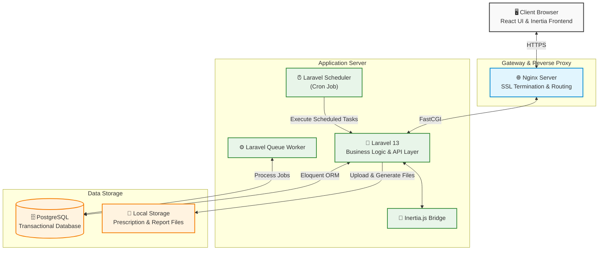
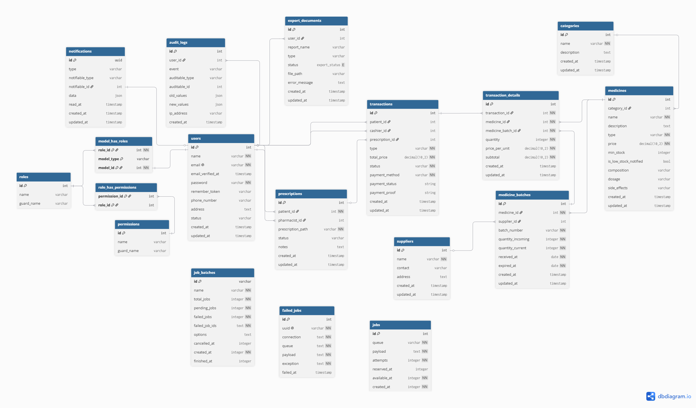

# 3. SDD (Software Design Document)

## 3.1 Arsitektur dan Infrastruktur

### Topologi Server

Sistem E-Commerce Penjualan Obat Klinik Makmur Jaya mengadopsi arsitektur Monolithic Modular Application dengan pendekatan Server-Driven SPA (Single Page Application) menggunakan Laravel 13, Inertia.js, dan React. Seluruh proses bisnis, autentikasi, manajemen stok, transaksi penjualan, hingga pelaporan berjalan dalam satu aplikasi Laravel yang terintegrasi.

Untuk menangani proses yang memerlukan waktu eksekusi lebih lama, seperti pembuatan laporan PDF dan pengiriman email, sistem memanfaatkan Laravel Queue yang dijalankan secara asynchronous. Selain itu, sistem menggunakan Laravel Scheduler yang dieksekusi melalui Cron Job untuk menjalankan tugas terjadwal seperti sinkronisasi data, pembersihan file sementara, dan proses otomatis lainnya.

Basis data menggunakan PostgreSQL sebagai sistem manajemen basis data relasional yang menjamin konsistensi data transaksi melalui mekanisme ACID (Atomicity, Consistency, Isolation, Durability).

---

### Spesifikasi Server yang Direkomendasikan

| Komponen         | Minimum                 | Direkomendasikan        |
| ---------------- | ----------------------- | ----------------------- |
| Processor        | 2 vCPU                  | 4 vCPU                  |
| RAM              | 4 GB                    | 8 GB                    |
| Storage          | 50 GB SSD               | 100 GB NVMe SSD         |
| Database         | PostgreSQL              | PostgreSQL              |
| Bandwidth        | 1 TB/bulan              | 2 TB/bulan              |
| Network Port     | 100 Mbps                | 1 Gbps                  |
| Operating System | Ubuntu Server 24.04 LTS | Ubuntu Server 24.04 LTS |

Menggunakan spesifikasi server yang direkomendasikan dapat mendukung performa yang lebih stabil pada proses transaksi, pengelolaan stok, pembuatan laporan PDF, dan pemrosesan antrean (queue worker). Selain itu secara umum sistem ini sudah mampu menangani ±100–300 pengguna aktif harian, ±20–50 pengguna bersamaan, ribuan transasksi perbulan, dan proses queue dan pembuatan PDF tanpa gangguan signifikan.

---

### Pemilihan Komponen & Framework

1. **Laravel 13 (Backend Framework)**: Dipilih sebagai framework utama karena menyediakan struktur pengembangan yang matang, sistem routing yang fleksibel, ORM Eloquent, queue processing, scheduler, serta fitur keamanan bawaan yang lengkap. Laravel juga mempercepat pengembangan aplikasi melalui ekosistem yang terintegrasi.

2. **Inertia.js (Frontend Bridge)**: Digunakan untuk menghubungkan Laravel dan React tanpa memerlukan pembangunan REST API secara penuh. Pendekatan ini menyederhanakan komunikasi antara backend dan frontend sehingga proses pengembangan menjadi lebih cepat dan pemeliharaan aplikasi lebih mudah.

3. **React 19 (Frontend UI Library)**: Digunakan untuk membangun antarmuka pengguna yang interaktif dan responsif. Pendekatan berbasis komponen memungkinkan pengembangan fitur yang modular dan mudah dipelihara.

4. **PostgreSQL 17 (Database Engine)**: Dipilih karena memiliki performa tinggi untuk transaksi relasional, mendukung integritas data yang kuat, serta mampu menangani transaksi secara bersamaan (concurrent transactions) dengan baik melalui mekanisme MVCC (Multi-Version Concurrency Control).

5. **Tailwind CSS 4 (Utility-First CSS Framework)**: Mempercepat proses pengembangan antarmuka dengan pendekatan utility-first yang konsisten dan terintegrasi dengan shadcn/ui.

6. **shadcn/ui (UI Component System)**: Menyediakan kumpulan komponen antarmuka yang modern serta fleksibel untuk dikustomisasi sehingga dapat membantu dalam mempercepat pengembangan antarmuka.

7. **Vite**: Digunakan sebagai build tool modern untuk proses pengembangan frontend dengan memberikan waktu kompilasi yang cepat, Hot Module Replacement (HMR), serta optimasi build yang lebih efisien dibandingkan bundler tradisional.

---

### Analisis Skalabilitas

1. **Efisiensi Pemrosesan Transaksi Database**: Sistem menggunakan PostgreSQL yang menerapkan mekanisme Multi-Version Concurrency Control (MVCC), sehingga proses pembacaan data katalog obat oleh banyak pengguna dapat berlangsung secara bersamaan tanpa menghambat proses transaksi penjualan yang sedang berjalan. Selain itu, transaksi kritis seperti pengurangan stok menggunakan mekanisme locking dan database transaction untuk menjaga konsistensi data ketika banyak pengguna melakukan pembelian pada waktu yang bersamaan.

2. **Pemrosesan Asinkron melalui Queue Worker**: Proses yang membutuhkan waktu eksekusi relatif lama, seperti pembuatan laporan PDF, ekspor data, impor data massal, dan pengiriman email, dipindahkan ke Laravel Queue Worker. Pendekatan ini mencegah proses-proses tersebut membebani request utama pengguna sehingga waktu respons aplikasi tetap stabil meskipun volume transaksi meningkat.

3. **Optimasi Arsitektur Monolitik Modular**: Sistem dikembangkan menggunakan pendekatan modular monolith, di mana setiap modul bisnis seperti pengguna, stok, transaksi, dan pelaporan dipisahkan secara logis. Struktur ini memudahkan optimasi atau pengembangan pada modul tertentu tanpa memengaruhi keseluruhan sistem, sehingga mendukung pertumbuhan fitur dan peningkatan beban aplikasi dalam jangka panjang.

4. **Otomatisasi Proses melalui Scheduler**: Berbagai proses rutin dijalankan menggunakan Laravel Scheduler dan Cron Job, seperti pembersihan file sementara dan pembuatan laporan berkala. Dengan memindahkan tugas-tugas terjadwal ke proses otomatis di luar request pengguna, sumber daya server dapat lebih difokuskan untuk melayani aktivitas transaksi dan akses pengguna.

5. **Skalabilitas Vertikal Infrastruktur**: Arsitektur aplikasi memungkinkan peningkatan kapasitas server (vertical scaling) melalui penambahan CPU, RAM, dan kapasitas penyimpanan tanpa memerlukan perubahan signifikan pada kode aplikasi. Pendekatan ini sesuai untuk kebutuhan sistem e-commerce klinik yang diproyeksikan mengalami pertumbuhan jumlah pengguna dan transaksi secara bertahap.

---

### Dokumentasi Library Pihak Ketiga

1. **laravel/reverb v1.x**: Lisensi MIT. Digunakan untuk menjalankan server WebSocket native PHP berkecepatan tinggi yang mendukung protokol Pusher untuk event broadcasting (notifikasi stok & pesanan).

2. **spatie/simple-excel v3.x**: Lisensi MIT. Digunakan untuk menangani proses parsing data impor katalog obat dalam format CSV/Excel secara massal menggunakan fitur ShouldQueue bawaan Laravel.

3. **barryvdh/laravel-dompdf v3.x**: Lisensi MIT. Digunakan untuk mengonversi tampilan laporan visual penjualan (Blade/HTML View) menjadi format dokumen PDF resmi berlogo klinik.

4. **opcodesio/log-viewer v3.x**: Lisensi MIT. Digunakan untuk menyediakan dashboard visual analisis log aplikasi Laravel secara real-time.

---

## 3.2 Rancangan Basis Data

### ERD (Entity-Relationship Diagram)

### Penjelasan Skema Basis Data

#### 1. Domain Autentikasi, Otorisasi (RBAC), Audit Trail, dan Notifikasi

Domain ini mengelola identitas pengguna, pembatasan hak akses, pencatatan jejak aktivitas, dan notifikasi sistem menggunakan komponen bawaan Laravel serta struktur RBAC bergaya Spatie.

1. **users**: Tabel inti autentikasi Laravel. Menyimpan seluruh entitas manusia (pasien, admin, apoteker, kasir) dengan atribut identitas dasar, kontak, alamat, dan status akun (`active/inactive`). Tabel ini terhubung langsung dengan mekanisme Auth, session, dan fitur autentikasi Fortify.

2. **roles, permissions, model_has_roles, role_has_permissions**: Struktur RBAC untuk pemetaan peran dan izin. Tabel `model_has_roles` menggunakan relasi polimorfik melalui kolom `model_type` dan `model_id`, sehingga peran dapat dikaitkan ke model lain selain User jika aplikasi berkembang di masa depan. Tabel `role_has_permissions` menjadi penghubung many-to-many antara role dan permission.

3. **audit_logs**: Tabel audit trail untuk merekam perubahan data penting. Kolom `auditable_type` dan `auditable_id` menunjuk ke entitas yang dimodifikasi, sedangkan `user_id` merekam pelaku perubahan. Nilai sebelum dan sesudah perubahan disimpan dalam `old_values` dan `new_values` bertipe JSON, lengkap dengan `ip_address` dan waktu kejadian.

4. **notifications**: Implementasi Laravel database notification system. Tabel ini menyimpan notifikasi persisten seperti peringatan stok minimum, impor selesai, atau konfirmasi pembayaran. Relasi polimorfik melalui `notifiable_type` dan `notifiable_id` memungkinkan notifikasi dikaitkan ke model penerima (saat ini pengguna). Kolom `read_at` menandai notifikasi yang sudah dibaca.

---

#### 2. Domain Master Data Katalog & Inventaris

Domain ini memisahkan katalog obat yang dilihat pengguna dari pengelolaan stok fisik berbasis batch untuk mendukung FIFO.

1. **categories & medicines**: `categories` menyimpan kategori obat, sedangkan `medicines` menyimpan identitas obat (nama, tipe, harga, komposisi, dosis, efek samping, dan ambang stok minimum). Relasi `medicines.category_id → categories.id` menggunakan SET NULL saat kategori dihapus, sehingga data obat tetap dapat dipertahankan.

2. **medicine_batches**: Pilar utama algoritma FIFO (First In First Out). Satu obat dapat memiliki banyak batch (One-to-Many). Setiap penerimaan stok dicatat sebagai baris baru dengan `batch_number`, `quantity_incoming`, `quantity_current`, `received_at`, dan `expired_at`. Pengurangan stok transaksi selalu menargetkan `quantity_current` pada batch terpilih sehingga urutan FIFO tetap konsisten.

3. **suppliers**: Menyimpan data pemasok obat (nama, kontak, alamat) dan menjadi sumber relasi untuk batch penerimaan barang. Relasi `medicine_batches.supplier_id → suppliers.id` menggunakan SET NULL agar riwayat batch tetap terjaga meskipun data pemasok dinonaktifkan atau dihapus.

---

#### 3. Domain Transaksi & Klinis

Domain ini merekam alur pembelian end-to-end sekaligus menjaga kepatuhan penebusan resep.

1. **prescriptions**: Mengelola dokumen resep dokter yang diunggah pasien. File fisik disimpan di Laravel Storage dan direferensikan melalui `prescription_path`. Kolom `status` (`pending/approved/rejected`) diperbarui oleh apoteker melalui `pharmacist_id` dan catatan verifikasi dapat disimpan di `notes`.

2. **transactions**: Pusat perekaman transaksi penjualan. Kolom `type` membedakan transaksi online dan offline. Untuk transaksi online, `patient_id` terisi; untuk transaksi POS klinik, `cashier_id` terisi. Relasi ke `prescription_id` bersifat opsional dan hanya digunakan jika transaksi melibatkan obat yang memerlukan resep. Status transaksi dan pembayaran dipisahkan melalui `status` dan `payment_status`.

3. **transaction_details**: Menyimpan rincian item per transaksi. Keberadaan `medicine_batch_id` sangat krusial karena mengunci batch spesifik yang benar-benar dikeluarkan dari stok sesuai urutan FIFO. Konfigurasi ini menjamin histori pengeluaran stok tetap konsisten dan dapat diaudit di masa mendatang.

---

#### 4. Domain Pemrosesan Latar Belakang (Queue & Job Batching)

Domain ini mendukung eksekusi pekerjaan asinkron agar proses berat tidak memperlambat respons pengguna.

1. **jobs**: Menyimpan antrean pekerjaan individual seperti pengiriman email, pembuatan dokumen ekspor, atau pemrosesan data impor. Queue worker Laravel mengambil pekerjaan dari tabel ini dan menjalankannya di latar belakang.

2. **job_batches**: Digunakan untuk mengelola pekerjaan berkelompok (batching), misalnya impor stok dalam jumlah besar. Tabel ini melacak progres melalui `total_jobs`, `pending_jobs`, dan `failed_jobs`.

3. **failed_jobs**: Menyimpan pekerjaan yang gagal dieksekusi beserta payload, koneksi, queue, dan exception. Data ini digunakan untuk diagnosis masalah dan proses retry melalui Artisan command.

---

#### 5. Domain Ekspor Laporan

Domain ini melacak proses pembuatan dokumen laporan secara asinkron.

1. **export_documents**: Mencatat permintaan ekspor laporan dari pengguna, termasuk nama laporan, jenis laporan (`inventory/transaction/audit/transfer`), status proses (`pending/processing/completed/failed`), lokasi file hasil generate (`file_path`), dan pesan kesalahan jika terjadi kegagalan. Tabel ini menjadi sumber status progres yang ditampilkan ke antarmuka admin.
