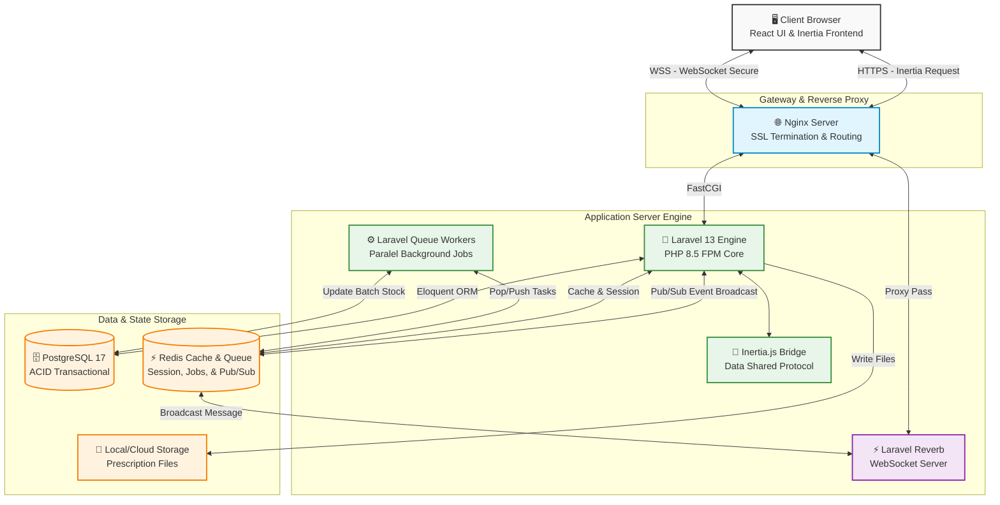

# 3. SDD (Software Design Document)

## 3.1 Arsitektur dan Infrastruktur

### Topologi Server

Sistem E-Commerce Penjualan Obat Klinik Makmur Jaya mengadopsi arsitektur monolitik modular dengan pendekatan Server-Driven SPA (Single Page Application) menggunakan Laravel 13, Inertia.js, dan React. Untuk menangani komunikasi dua arah secara real-time (seperti notifikasi pesanan dan sinkronisasi stok instan), sistem mengintegrasikan WebSocket Server bawaan ekosistem Laravel (Laravel Reverb). Basis data menggunakan PostgreSQL 17 untuk mengelola beban relasional tinggi dan integritas data (ACID) dengan performa maksimal.



---

### Pemilihan Komponen & Framework

1. **Laravel 13 (Backend Framework)**: Menawarkan performa eksekusi lebih cepat dengan PHP 8.5. Membawa ekosistem bawaan yang matang untuk routing, proteksi keamanan tingkat tinggi, manajemen antrean, dan ORM yang sangat optimal.

2. **Inertia.js (Frontend Bridge)**: Menghilangkan kebutuhan untuk membangun REST API yang terpisah secara penuh, memungkinkan state React dikontrol langsung dari controller Laravel.

3. **React.js (Frontend UI Library)**: Memungkinkan pembuatan antarmuka reaktif. Sangat cocok disandingkan dengan WebSocket untuk merender ulang komponen (seperti sisa stok atau status pesanan) secara instan tanpa me-refresh halaman.

4. **PostgreSQL 17 (Database Engine)**: Sangat tangguh untuk menangani transaksi konkuren dengan kapabilitas Row-Level Locking yang superior. Mendukung tipe data JSONB tingkat lanjut jika diperlukan untuk fitur audit logging.

5. **Laravel Reverb (Real-time Server)**: Solusi WebSocket pihak pertama dari Laravel. Mengeliminasi overhead HTTP Long-Polling sehingga sinkronisasi stok fisik dan online terjadi seketika (instant push).

6. **Redis (Cache & Queue Driver)**: Esensial untuk fitur Pub/Sub yang digunakan oleh WebSocket, serta mengelola manajemen Cache Lock untuk menghindari insiden Race Condition saat proses checkout bersamaan.

7. **shadcn/ui (UI Component System)**: Menyediakan kumpulan komponen antarmuka yang modern serta fleksibel untuk dikustomisasi sehingga dapat membantu dalam mempercepat pengembangan antarmuka.

8. **Tailwind CSS (Utility-First CSS Framework)**: Mempercepat proses pengembangan antarmuka dengan pendekatan utility-first yang konsisten dan terintegrasi secara manual dengan shadcn/ui.

---

### Analisis Skalabilitas

1. **WebSocket Offloading**: Menggantikan teknik polling API tradisional. Browser pasien tidak perlu mengirim request HTTP berulang-ulang ke server untuk mengecek status pesanan. Server (via Reverb) akan langsung "mendorong" (push) data baru ke client secara real-time, menghemat resource bandwidth dan beban CPU secara drastis.

2. **PostgreSQL Concurrency Control**: Dengan MVCC (Multi-Version Concurrency Control) pada PostgreSQL 17, proses pembacaan data katalog oleh ribuan pasien tidak akan memblokir proses penulisan transaksi (checkout) yang sedang dilakukan pasien lain. Aplikasi menggunakan skema `lockForUpdate()` di Eloquent secara spesifik pada baris `medicine_batches` untuk mencegah duplikasi pemotongan FIFO.

3. **Asynchronous Background Processing**: Pencetakan PDF analitik bisnis, batch insert impor stok massal, dan pengiriman email faktur diisolasi dari proses thread utama pengguna ke Queue Worker di Redis.

---

### Dokumentasi Library Pihak Ketiga

1. **laravel/reverb v1.x**: Lisensi MIT. Digunakan untuk menjalankan server WebSocket native PHP berkecepatan tinggi yang mendukung protokol Pusher untuk event broadcasting (notifikasi stok & pesanan).

2. **spatie/simple-excel v3.x**: Lisensi MIT. Digunakan untuk menangani proses parsing data impor katalog obat dalam format CSV/Excel secara massal menggunakan fitur ShouldQueue bawaan Laravel.

3. **barryvdh/laravel-dompdf v3.x**: Lisensi MIT. Digunakan untuk mengonversi tampilan laporan visual penjualan (Blade/HTML View) menjadi format dokumen PDF resmi berlogo klinik.

---

## 3.2 Rancangan Basis Data

### ERD (Entity-Relationship Diagram)

---


### Penjelasan Skema Basis Data

#### 1. Domain Autentikasi, RBAC, & Audit Trail

Domain ini mengelola identitas, pembatasan hak akses lintas entitas, dan perekaman jejak aktivitas secara mutakhir menggunakan package ekosistem Laravel.

1. **users**: Tabel core Laravel untuk autentikasi. Menyimpan seluruh entitas manusia (Pasien, Admin, Apoteker, Kasir) dengan kapabilitas soft-state melalui kolom `status` (`active/inactive`) dan terintegrasi langsung dengan fasad `Auth`.

2. **Tabel RBAC (roles, permissions, model_has_roles, role_has_permissions)**: Mengadopsi struktur bawaan Spatie Laravel-Permission. Kolom `model_type` dan `model_id` pada tabel `model_has_roles` menggunakan konsep relasi polimorfik (*Polymorphic Relations*) Laravel. Hal ini memungkinkan peran (*role*) tidak hanya disematkan pada model `User`, tetapi juga model lain jika aplikasi berkembang di masa depan.

3. **activity_log**: Mengadopsi struktur Spatie Activitylog. Tabel ini mencatat jejak audit secara detail tanpa perlu hardcode nama tabel. Kolom `subject_type` dan `subject_id` secara polimorfik merujuk pada model/data yang sedang dimodifikasi (misal: data transaksi), sedangkan `causer_type` dan `causer_id` merujuk pada user yang melakukan modifikasi. Detail perubahan disimpan di kolom `properties` dengan format tipe data JSON.

---

#### 2. Domain Master Katalog & Inventaris

Domain ini merancang pemisahan antara tampilan produk yang dilihat pengguna dan manajemen pergerakan barang di gudang.

1. **categories & medicines**: Skema utama pengisian etalase. Tabel `medicines` mendefinisikan identitas obat dasar (nama, tipe, harga) dan menggunakan relasi Foreign Key ke `categories`.

2. **medicine_batches**: Pilar utama dari algoritma FIFO (*First In First Out*). Satu baris di tabel `medicines` dapat memiliki relasi One-to-Many ke `medicine_batches`. Setiap suplai baru dari `suppliers` dicatat sebagai baris batch baru di sini, lengkap dengan `quantity_current` dan `expired_at`. Query aplikasi hanya akan menargetkan tabel ini untuk melakukan pengurangan stok fisik.

---

#### 3. Domain Transaksi & Klinis

Domain ini merekam alur checkout dari ujung ke ujung, sekaligus menjaga kepatuhan proses medis untuk penebusan resep.

1. **prescriptions**: Mengelola dokumen resep dokter. Pasien membuat data awal di sini. Tabel ini menampung rujukan file fisik di Laravel Storage (`prescription_path`), lalu menunggu intervensi dari `pharmacist_id` untuk memperbarui status persetujuan.

2. **transactions**: Pusat perekaman status pembelian. Kolom `type` menentukan alur transaksi. Jika online, `patient_id` akan terisi. Jika offline dari konter, `cashier_id` yang akan mengisi. Transaksi akan terhubung ke `prescription_id` hanya jika produk di dalam keranjang mewajibkan dokumen resep.

3. **transaction_details**: Merupakan rincian isi keranjang. Adanya kolom `medicine_batch_id` sangat krusial. Ini mengunci riwayat bahwa sebuah obat dikeluarkan dari "Nomor Batch" yang mana. Konfigurasi ini menjamin konsistensi laporan pengeluaran stok sesuai prinsip FIFO tanpa risiko data mismatch di kemudian hari.

---

#### 4. Domain Pemrosesan Latar Belakang (Queue & Job Batching)

Tabel-tabel ini adalah blueprint orisinal dari arsitektur Laravel Queue untuk menangani skalabilitas sistem tanpa mengorbankan performa (UX) di sisi React.

1. **jobs**: Menampung antrean pekerjaan tunggal yang asinkron, seperti transmisi email notifikasi pembayaran.

2. **job_batches**: Spesifik untuk mengelola tugas berkelompok (*Batching*). Sangat krusial ketika Admin mengimpor puluhan ribu baris data stok obat dari file Excel. Tabel ini melacak progres penyelesaian pekerjaan (`total_jobs`, `pending_jobs`) yang datanya bisa diteruskan secara real-time ke antarmuka pengguna.

3. **failed_jobs**: Mengamankan pekerjaan yang gagal dieksekusi (misal: karena server SMTP mati). Pengembang dapat melacak tumpukan error (*exception*) langsung dari tabel ini dan melakukan retry pekerjaan tersebut melalui Artisan command.

---

## 3.3 Kebutuhan Migrasi dan Pembaharuan

### Simulasi Migrasi Data (Manual ke E-Commerce)

#### 1. Strategi Migrasi Data Obat

Proses perpindahan data dari spreadsheet ke PostgreSQL dilakukan menggunakan fitur Laravel Seeder atau Artisan Command khusus. Proses ini menerapkan metode Chunking (baca 1000 baris per iterasi) untuk mengamankan limitasi memori PHP 8.5, serta mencocokkan ID obat lama dengan relasi kategori secara programatis.

---

#### 2. Mapping Field Table

| Data Spreadsheet Manual | Skema Tabel PostgreSQL            | Tipe Data PostgreSQL | Keterangan                               |
| ----------------------- | --------------------------------- | -------------------- | ---------------------------------------- |
| KODE_OBAT               | medicines.id                      | BIGINT               | Auto-increment PK                        |
| NAMA_OBAT               | medicines.name                    | VARCHAR              | Dibersihkan dari karakter spasi berlebih |
| HARGA_JUAL              | medicines.price                   | NUMERIC(10,2)        | Sesuai standar mata uang presisi         |
| NO_BATCH                | medicine_batches.batch_number     | VARCHAR              | Unique identifier produksi               |
| STOK_FISIK              | medicine_batches.quantity_current | INTEGER              | Stok FIFO berjalan saat ini              |
| TGL_EXPIRED             | medicine_batches.expired_at       | DATE                 | Dikonversi ke format ISO (YYYY-MM-DD)    |

---

#### 3. Validasi Data Pasca Migrasi

1. **Validasi Jumlah Data**: Total row antara spreadsheet dan table instances identik.

2. **Validasi Nilai Persediaan**: Total valuasi harga stok di RDBMS tidak berselisih dengan rekapan catatan bendahara klinik.

---

#### 4. Rollback Plan

1. **Rollback Database Transaction**: Jika terjadi anomali (misalnya format tanggal rusak pada baris ke-5000), blok kode `DB::transaction()` akan memicu `DB::rollBack()`.

2. **Restore Backup Database**: Infrastruktur data akan dikembalikan menggunakan utility `pg_restore` dari dump cadangan (`.dump`) terakhir.

---

### Dokumen Cutover Plan

#### 1. Timeline Eksekusi

1. **H-2 (Kamis, 21.00 WIB)**: Freeze input inventaris baru di sisi admin klinik.

2. **H-1 (Jumat, 18.00 WIB)**: Operasional dihentikan sementara untuk sinkronisasi nilai Stock Opname akhir.

3. **Hari H (Sabtu, 00.01 - 04.00 WIB)**: Migrasi final data ke Production Database (PostgreSQL 17), penyalaan WebSocket Reverb Server, verifikasi SSL.

4. **Hari H (Sabtu, 06.00 WIB)**: Akses operasional sistem dibuka 100%.

---

#### 2. Langkah Cutover Utama (Sysadmin)

1. **Aktifkan Maintenance Mode**: Eksekusi `php artisan down` (Mencegah trafik nyasar).

2. **Migrasi Database**: Terapkan tabel via `php artisan migrate --force`.

3. **Menjalankan Reverb Server**: Jalankan `php artisan reverb:start --daemon` (via Supervisor).

4. **Impor Data Produksi**: Impor master data obat terakhir.

5. **Nonaktifkan Maintenance Mode**: Cabut maintenance mode dengan `php artisan up`.

---

### Impact Analysis Matrix (Perubahan Fitur)

| Modul yang Diubah           | Komponen Terkena Dampak        | Tingkat Risiko | Potensi Masalah                                                                | Mitigasi Wajib                                                                   |
| --------------------------- | ------------------------------ | -------------- | ------------------------------------------------------------------------------ | -------------------------------------------------------------------------------- |
| Logika Stok (FIFO)          | Kasir (Offline) & Web (Online) | Tinggi         | Kesalahan substraction sehingga stok minus                                     | Integrasi Pessimistic Locking PostgreSQL & Unit Test konkuren                    |
| Broadcast Event (WebSocket) | Frontend Real-time (React)     | Medium         | Layar pengguna gagal update otomatis jika server Reverb down                   | Konfigurasi fallback mechanism (tombol refresh manual jika koneksi WSS terputus) |
| Sistem RBAC                 | Menu Navigasi Pengguna         | Tinggi         | Pasien bisa melihat dashboard analitik atau kasir tak bisa buka menu transaksi | Uji rute ketat via Inertia Middleware `role:admin`                               |

---

## 3.4 Dokumentasi Teknis dan Panduan Pengguna

### Panduan Pengguna (User Guide) Modul Pembelian Online

#### Langkah Pembelian Real-Time

1. **Akses Katalog**: Akses halaman katalog Klinik Makmur Jaya.

2. **Cari Obat**: Cari obat menggunakan kotak pencarian pintar.

3. **Tambah ke Keranjang**: Klik Tambah ke Keranjang. (Jika obat adalah obat keras, pop-up upload resep akan otomatis muncul).

4. **Lanjutkan Pembayaran**: Pada halaman keranjang, klik Lanjutkan ke Pembayaran dan tentukan metode pengiriman.

5. **Selesaikan Pembayaran**: Anda akan diarahkan ke halaman Pelacakan Pesanan.

6. **Pantau Status Secara Live**: Anda tidak perlu me-refresh halaman. Jika apoteker telah menyiapkan obat Anda, status di layar akan otomatis berubah dari "Diproses" menjadi "Siap Diambil / Dikirim" dalam hitungan detik.

---

### FAQ (Frequently Asked Questions)

1. **Apakah saya perlu me-refresh layar terus-menerus untuk mengecek pesanan saya?**: Tidak. Sistem kami menggunakan teknologi sinkronisasi langsung (WebSocket). Perubahan status apa pun dari pihak apoteker akan langsung muncul di layar perangkat Anda secara otomatis.

2. **Apakah stok yang tertera di website akurat dengan di klinik?**: Ya. Karena terintegrasi secara langsung (real-time), apabila pelanggan di klinik fisik membeli sisa satu-satunya obat, layar website Anda akan seketika memperbarui keterangan stok menjadi "Habis".

3. **Bagaimana jika resep yang saya unggah kurang jelas?**: Apoteker akan memberikan status "Ditolak" disertai alasan di layar pelacakan Anda secara live, dan Anda bisa langsung mengunggah ulang dokumen yang lebih terang/jelas.

4. **Berapa lama waktu untuk proses verifikasi resep?**: Selama jam operasional (08.00 - 21.00), proses verifikasi rata-rata hanya memakan waktu 5–15 menit berkat sistem notifikasi instan kami.

5. **Bagaimana prioritas obat yang akan diberikan kepada saya?**: Kami menggunakan standarisasi keamanan farmasi (FIFO). Anda akan selalu mendapatkan stok obat yang masa kadaluarsanya masih jauh dan layak konsumsi.

---

### Dokumentasi API (Contoh Endpoint & WebSocket Broadcast)

#### 1. Sinkronisasi Checkout Terpusat

1. **Endpoint**: `POST /api/v1/orders/checkout`

2. **Fungsi**: Memvalidasi transaksi, mengurangi stok (PostgreSQL Lock), dan memicu event broadcast ke WebSocket.

3. **Payload Request (JSON)**:

```json
{
  "type": "online",
  "payment_method": "qris",
  "items": [
    {
      "medicine_id": 204,
      "quantity": 1
    }
  ]
}
```

4. **Response Sukses (201 Created)**:

```json
{
  "success": true,
  "transaction_id": 901,
  "message": "Pesanan divalidasi. Stok dikunci via FIFO."
}
```

---

#### 2. Skema Event Broadcast (WebSocket Reverb)

1. **Channel**: `private-orders.{patient_id}`

2. **Event Name**: `OrderStatusUpdated`

3. **Fungsi**: Mengirimkan perubahan dari Kasir/Apoteker ke layar HP pasien tanpa delay HTTP.

4. **Payload Socket (JSON)**:

```json
{
  "transaction_id": 901,
  "status": "ready_for_pickup",
  "message": "Obat Anda telah selesai dikemas dan siap diambil di konter Klinik Makmur Jaya.",
  "timestamp": "2026-06-03T07:47:00Z"
}
```