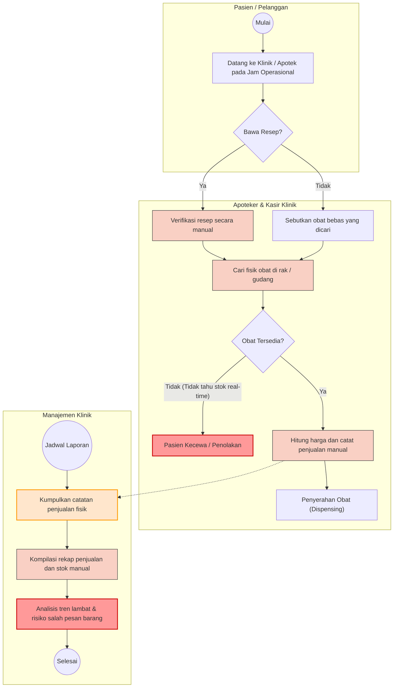
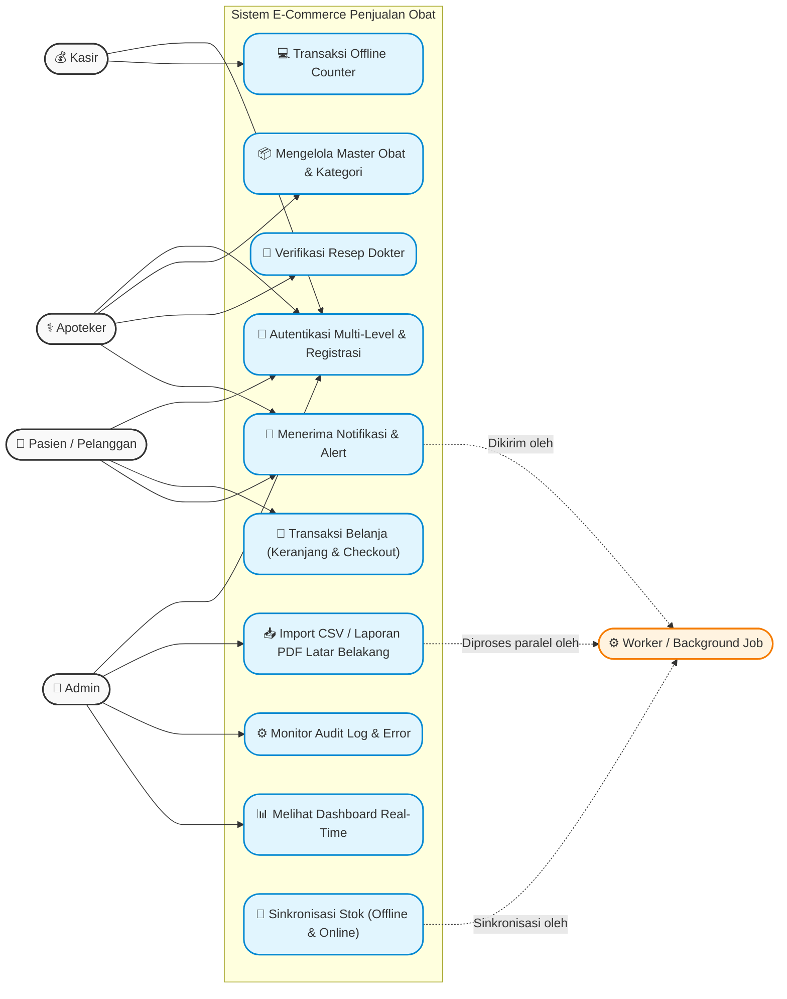
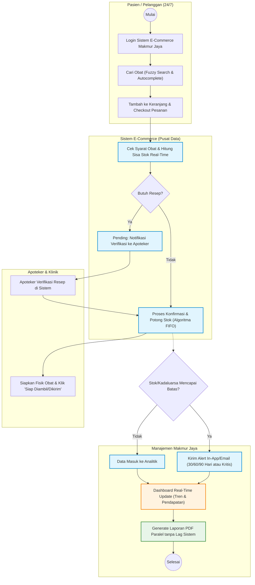
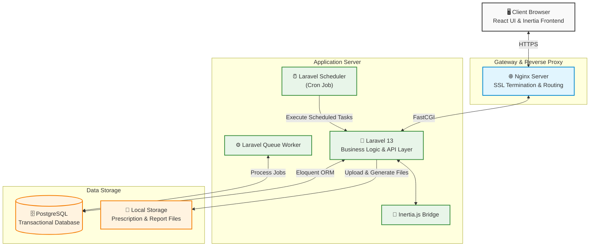

# 1. BRD (Business Requirements Document)

## 1.1 Pendahuluan

Klinik Makmur Jaya adalah sebuah klinik kesehatan yang berlokasi di kota besar di Indonesia dan menyediakan layanan konsultasi medis serta penjualan obat-obatan kepada pasien. Klinik ini melayani rata-rata 150–200 pasien per hari dengan inventaris yang masif, mencapai lebih dari 2.000 jenis obat dari berbagai kategori, meliputi obat resep, obat bebas, suplemen, dan alat kesehatan.

Saat ini, operasional penjualan obat di klinik menghadapi berbagai kendala karena masih mengandalkan proses manual dan ketiadaan platform digital. Hal ini tidak hanya membatasi akses pasien terhadap layanan farmasi di luar jam operasional, tetapi juga memicu inefisiensi dalam manajemen persediaan dan pelaporan. Sebagai langkah strategis untuk menyelesaikan permasalahan tersebut, manajemen Klinik Makmur Jaya memutuskan untuk menginisiasi pembangunan sistem e-commerce penjualan obat berbasis web. Sistem ini dirancang untuk mendigitalkan seluruh proses transaksi, pengelolaan inventaris real-time, dan memperluas jangkauan layanan melalui pembelian daring.

---

## 1.2 Identifikasi Masalah

1. Proses penjualan obat saat ini masih dilakukan secara manual, yang memicu ketidakteraturan dalam pencatatan transaksi dan berisiko menimbulkan kesalahan pelayanan kepada pasien.
2. Tidak tersedianya platform berbasis web untuk pembelian daring membatasi akses pasien terhadap layanan farmasi terutama ketika berada di luar jam operasional klinik.
3. Ketiadaan sistem pemantauan stok secara real-time berpotensi menyebabkan keterlambatan pengisian ulang (restock), kekurangan stok obat, atau kelebihan persediaan yang berdampak pada inefisiensi.
4. Proses pelaporan penjualan tidak terintegrasi, membuat manajemen kesulitan dalam menganalisis tren penjualan dan merumuskan keputusan strategis terkait pengadaan obat.
5. Proses verifikasi resep dokter yang masih berjalan secara manual memakan waktu lama dan meningkatkan risiko terjadinya kesalahan pemberian obat (dispensing).

---

## 1.3 Tujuan & Kriteria Keberhasilan

1. Menyediakan platform e-commerce yang memungkinkan pembelian obat secara daring lengkap dengan fitur keranjang belanja, checkout, dan konfirmasi pembayaran.
2. Mengimplementasikan sistem manajemen inventaris real-time dengan algoritma FIFO otomatis yang mampu memberikan peringatan dini ketika stok mencapai batas minimum atau mendekati masa kadaluarsa (90, 60, dan 30 hari).
3. Mendigitalkan dan mengotomatisasi proses verifikasi resep dokter untuk mempercepat waktu layanan dan meminimalkan risiko kesalahan dispensing.
4. Menyediakan dashboard pelaporan dan monitoring real-time bagi manajemen yang menampilkan data interaktif terkait penjualan (harian/mingguan/bulanan), ketersediaan stok, dan pendapatan.
5. Menciptakan sistem yang aman dengan perlindungan terhadap serangan siber (SQL Injection, XSS, CSRF), autentikasi multi-level, dan pencatatan aktivitas pengguna melalui audit log.

---

## 1.4 Profil Pengguna

1. **Admin**: Bertanggung jawab untuk mengelola sistem keamanan, memantau dashboard log error, menerima notifikasi error/exception aplikasi, dan melihat seluruh aktivitas pengguna melalui audit log.

2. **Apoteker**: Bertanggung jawab mengelola stok obat, menerima notifikasi otomatis ketika ada pesanan baru masuk atau obat yang mendekati tanggal kadaluarsa, serta melakukan verifikasi resep dokter secara sistem.

3. **Kasir**: Bertugas menangani transaksi penjualan secara langsung (counter) yang stoknya tersinkronisasi secara real-time dengan sistem penjualan online.

4. **Pasien/Pelanggan**: Pengguna akhir yang dapat melakukan registrasi, mencari obat pada katalog, mengelola keranjang belanja, melakukan checkout pesanan, serta menerima notifikasi status pesanan (dikonfirmasi, diproses, siap diambil, atau dikirim).

---

## 1.5 AS-IS Business Process



---

# 2. SRS (Software Requirements Specification)

## 2.1 Deskripsi Umum Aplikasi

Sistem ini dirancang untuk mendigitalkan seluruh proses pelayanan farmasi dan penjualan pada Klinik Makmur Jaya. Platform ini dibangun untuk memfasilitasi transaksi harian yang mencapai 150–200 pasien serta mengelola inventaris dalam skala besar yang mencakup lebih dari 2.000 jenis obat.

Aplikasi ini akan menggunakan arsitektur web modern yang mendukung pemrosesan data secara paralel, sistem manajemen basis data yang mengutamakan integritas dengan perlindungan terhadap serangan siber (SQL Injection, XSS, CSRF), serta kemampuan sinkronisasi real-time antara transaksi di klinik secara fisik dengan transaksi online.

---

## 2.2 Kebutuhan Fungsional

### Modul 1: Autentikasi dan Keamanan

1. Sistem login dengan autentikasi multi-level (Admin, Apoteker, Kasir, Pasien/Pelanggan)
2. Sistem registrasi pelanggan dengan verifikasi email dan validasi data diri
3. Implementasi password hashing (bcrypt/argon2) dan validasi kekuatan password
4. Proteksi terhadap serangan SQL Injection, XSS, dan CSRF
5. Sistem session management dengan timeout otomatis
6. Audit log untuk mencatat seluruh aktivitas pengguna (siapa, kapan, melakukan apa)
7. Dokumen analisis risiko keamanan informasi beserta langkah mitigasi

---

### Modul 2: Dashboard dan Real-Time Monitoring

1. Dashboard utama dengan grafik dan chart interaktif menampilkan ringkasan penjualan harian/mingguan/bulanan, stok obat, dan pendapatan
2. Katalog obat berbasis web dengan fitur pencarian, filter kategori (obat resep, obat bebas, suplemen, alat kesehatan), dan sorting harga
3. Halaman detail produk dengan informasi lengkap: nama obat, deskripsi, komposisi, dosis, efek samping, harga, dan ketersediaan stok
4. Galeri produk dengan fitur upload dan preview gambar obat (multimedia)
5. Real-time notification ketika ada perubahan stok kritis atau pesanan baru masuk
6. Export laporan penjualan dalam format PDF dengan elemen visual (logo klinik, grafik, tabel berwarna)

---

### Modul 3: Manajemen Data dan Transaksi (CRUD + SQL)

1. CRUD lengkap untuk data: Obat, Kategori Obat, Supplier, Pelanggan, Transaksi Penjualan, dan Resep
2. Implementasi query SQL untuk laporan penjualan, stok terlaris, obat mendekati kadaluarsa, dan rekap transaksi
3. Algoritma pencarian obat dengan fitur autocomplete dan fuzzy search
4. Algoritma perhitungan stok otomatis berbasis FIFO (First In First Out) untuk mengelola obat berdasarkan tanggal kadaluarsa
5. Pagination, sorting, dan filtering data dengan performa optimal
6. Fitur keranjang belanja (cart): tambah, hapus, ubah jumlah, dan hitung total harga
7. Proses checkout dengan pilihan metode pembayaran dan konfirmasi pesanan
8. Sistem verifikasi resep dokter untuk obat-obatan yang memerlukan resep

---

### Modul 4: Sistem Notifikasi dan Alert

1. Alert otomatis ketika stok obat di bawah minimum threshold (email dan/atau in-app notification)
2. Notifikasi otomatis kepada apoteker ketika ada obat mendekati tanggal kadaluarsa (30/60/90 hari sebelumnya)
3. Notifikasi kepada pelanggan terkait status pesanan (dikonfirmasi, diproses, siap diambil/dikirim)
4. Notifikasi error/exception pada aplikasi yang dikirim ke admin
5. Dashboard log error dengan kategorisasi severity (critical, warning, info)

---

### Modul 5: Pemrosesan Paralel dan Manajemen Pesanan

1. Fitur pemrosesan pesanan secara paralel sehingga beberapa pesanan dapat diproses bersamaan tanpa bottleneck pada sistem
2. Batch import data obat dari file CSV/Excel dengan proses paralel untuk pembaruan katalog
3. Background job untuk generate laporan penjualan besar tanpa mengganggu respons UI
4. Implementasi job queue untuk pemrosesan pembayaran dan update stok secara otomatis
5. Sinkronisasi stok real-time antara penjualan di counter (offline) dan penjualan online


---

## 2.3 Kebutuhan Non-Fungsional

1. **Arsitektur & Server**: Penentuan spesifikasi minimum terkait Prosesor, RAM, Storage, dan Bandwidth melalui dokumen arsitektur infrastruktur web server dan database server untuk e-commerce.

2. **Skalabilitas & Performa**: Aplikasi dituntut memiliki kemampuan adaptasi terhadap peningkatan tajam pengguna dan volume transaksi tanpa mengalami degradasi performa. Pagination dan filtering data harus dikonfigurasi untuk memberikan waktu muat optimal.

3. **Migrasi Data**: Tersedianya dokumen cutover plan yang mencakup strategi migrasi obat dari file spreadsheet, pemetaan mapping field, verifikasi pasca migrasi, serta skenario pembatalan (rollback plan) jika ditemui kesalahan.

4. **Dokumentasi User & Teknis**: Ketersediaan buku panduan teknis (user guide), dokumen analisis risiko, dokumen API, panduan pemecahan masalah (troubleshooting), dan pertanyaan umum (FAQ) bagi pelanggan minimal 10 pertanyaan.

---

## 2.4 Diagram Use Case



---

## 2.5 Definisi Aktor

1. **Admin**: Pihak dengan otoritas tertinggi untuk mengatur hak akses, membaca log pergerakan (audit log), mengecek kendala di dashboard log error, serta melakukan tindakan pemeliharaan sistem.

2. **Apoteker**: Personel medis yang melakukan kurasi serta pengelolaan detail data obat di katalog, berwenang menyetujui (verifikasi) pesanan dengan syarat resep dokter, dan bertugas merespons notifikasi kadaluarsa stok obat.

3. **Kasir**: Pengguna internal operasional yang menangani pencatatan pembayaran pesanan offline langsung di konter klinik.

4. **Pasien/Pelanggan**: Pengguna umum yang melalui tahap registrasi diri guna melakukan pencarian pada katalog obat, pembelian melalui keranjang, checkout pembayaran, serta pelacakan pengiriman.

5. **Background Job / Worker**: Sistem non-interaktif di balik layar yang menjalankan beban pekerjaan masif secara paralel seperti pencetakan laporan berat, impor data dari CSV, sinkronisasi stok, perhitungan FIFO otomatis, dan transmisi email pesanan.

---

## 2.6 Deskripsi Use Case

1. **UC1: Autentikasi Multi-Level & Registrasi**: Pasien umum harus menyelesaikan registrasi dan validasi email untuk berbelanja. Semua sesi pengguna akan terlindungi oleh hashing kriptografi lanjutan.

2. **UC2: Mengelola Master Obat & Kategori**: Fasilitas CRUD lengkap yang diperuntukkan bagi Apoteker dan Admin untuk mengisi nama, harga, deskripsi, upload gambar, hingga penentuan tanggal kadaluarsa.

3. **UC3: Transaksi Belanja (Keranjang & Checkout)**: Kemampuan yang digunakan oleh Pasien/Pelanggan untuk mencari obat dengan metode Fuzzy Search, menempatkan obat ke keranjang (cart), lalu menetapkan metode pembayaran untuk dibeli.

4. **UC4: Verifikasi Resep Dokter**: Pasien yang membeli obat jenis spesifik diwajibkan unggah resep, lalu apoteker akan mengevaluasi keabsahan dokumen via sistem sebelum obat dapat diproses.

5. **UC5: Transaksi Offline Counter**: Kasir mengoperasikan sistem di konter klinik bagi pasien walk-in yang langsung mengurangi stok global di sistem.

6. **UC6: Melihat Dashboard Real-Time**: Fitur visual data statistik yang merangkum keseluruhan penjualan harian, mingguan, bulanan, serta tingkat pendapatan, guna dipakai untuk memetakan keputusan strategis pengadaan barang.

7. **UC7: Import CSV / Laporan PDF Latar Belakang**: Admin menginisiasi instruksi untuk menyerap ribuan baris data obat baru, atau mengekspor laporan akhir bulan dalam bentuk PDF berlogo tanpa membekukan halaman.

8. **UC8: Menerima Notifikasi & Alert**: Fungsi pemancaran siaran sistem atas pergerakan baru (seperti alert sisa waktu kadaluarsa 30/60/90 hari atau notifikasi status pesanan siap kirim).

9. **UC9: Monitor Audit Log & Error**: Ruang kerja Admin untuk merespons kategori kejanggalan error aplikasi (Info/Warning/Critical) dan melacak histori aksi seluruh aktor.

---

## 2.7 TO-BE Business Process



---

# 3. SDD (Software Design Document)

## 3.1 Arsitektur dan Infrastruktur

### Topologi Server

Sistem E-Commerce Penjualan Obat Klinik Makmur Jaya mengadopsi arsitektur Monolithic Modular Application dengan pendekatan Server-Driven SPA (Single Page Application) menggunakan Laravel 13, Inertia.js, dan React. Seluruh proses bisnis, autentikasi, manajemen stok, transaksi penjualan, hingga pelaporan berjalan dalam satu aplikasi Laravel yang terintegrasi.

Untuk menangani proses yang memerlukan waktu eksekusi lebih lama, seperti pembuatan laporan PDF dan pengiriman email, sistem memanfaatkan Laravel Queue yang dijalankan secara asynchronous. Selain itu, sistem menggunakan Laravel Scheduler yang dieksekusi melalui Cron Job untuk menjalankan tugas terjadwal seperti sinkronisasi data, pembersihan file sementara, dan proses otomatis lainnya.

Basis data menggunakan PostgreSQL sebagai sistem manajemen basis data relasional yang menjamin konsistensi data transaksi melalui mekanisme ACID (Atomicity, Consistency, Isolation, Durability).



---

### Spesifikasi Server yang Direkomendasikan

| Komponen         | Minimum                 | Direkomendasikan        |
| ---------------- | ----------------------- | ----------------------- |
| Processor        | 2 vCPU                  | 4 vCPU                  |
| RAM              | 4 GB                    | 8 GB                    |
| Storage          | 50 GB SSD               | 100 GB NVMe SSD         |
| Database         | PostgreSQL              | PostgreSQL              |
| Bandwidth        | 1 TB/bulan              | 2 TB/bulan              |
| Network Port     | 100 Mbps                | 1 Gbps                  |
| Operating System | Ubuntu Server 24.04 LTS | Ubuntu Server 24.04 LTS |

Menggunakan spesifikasi server yang direkomendasikan dapat mendukung performa yang lebih stabil pada proses transaksi, pengelolaan stok, pembuatan laporan PDF, dan pemrosesan antrean (queue worker). Selain itu secara umum sistem ini sudah mampu menangani ±100–300 pengguna aktif harian, ±20–50 pengguna bersamaan, ribuan transasksi perbulan, dan proses queue dan pembuatan PDF tanpa gangguan signifikan.

---

### Pemilihan Komponen & Framework

1. **Laravel 13 (Backend Framework)**: Dipilih sebagai framework utama karena menyediakan struktur pengembangan yang matang, sistem routing yang fleksibel, ORM Eloquent, queue processing, scheduler, serta fitur keamanan bawaan yang lengkap. Laravel juga mempercepat pengembangan aplikasi melalui ekosistem yang terintegrasi.

2. **Inertia.js (Frontend Bridge)**: Digunakan untuk menghubungkan Laravel dan React tanpa memerlukan pembangunan REST API secara penuh. Pendekatan ini menyederhanakan komunikasi antara backend dan frontend sehingga proses pengembangan menjadi lebih cepat dan pemeliharaan aplikasi lebih mudah.

3. **React 19 (Frontend UI Library)**: Digunakan untuk membangun antarmuka pengguna yang interaktif dan responsif. Pendekatan berbasis komponen memungkinkan pengembangan fitur yang modular dan mudah dipelihara.

4. **PostgreSQL 17 (Database Engine)**: Dipilih karena memiliki performa tinggi untuk transaksi relasional, mendukung integritas data yang kuat, serta mampu menangani transaksi secara bersamaan (concurrent transactions) dengan baik melalui mekanisme MVCC (Multi-Version Concurrency Control).

5. **Tailwind CSS 4 (Utility-First CSS Framework)**: Mempercepat proses pengembangan antarmuka dengan pendekatan utility-first yang konsisten dan terintegrasi dengan shadcn/ui.

6. **shadcn/ui (UI Component System)**: Menyediakan kumpulan komponen antarmuka yang modern serta fleksibel untuk dikustomisasi sehingga dapat membantu dalam mempercepat pengembangan antarmuka.

7. **Vite**: Digunakan sebagai build tool modern untuk proses pengembangan frontend dengan memberikan waktu kompilasi yang cepat, Hot Module Replacement (HMR), serta optimasi build yang lebih efisien dibandingkan bundler tradisional.

---

### Analisis Skalabilitas

1. **Efisiensi Pemrosesan Transaksi Database**: Sistem menggunakan PostgreSQL yang menerapkan mekanisme Multi-Version Concurrency Control (MVCC), sehingga proses pembacaan data katalog obat oleh banyak pengguna dapat berlangsung secara bersamaan tanpa menghambat proses transaksi penjualan yang sedang berjalan. Selain itu, transaksi kritis seperti pengurangan stok menggunakan mekanisme locking dan database transaction untuk menjaga konsistensi data ketika banyak pengguna melakukan pembelian pada waktu yang bersamaan.

2. **Pemrosesan Asinkron melalui Queue Worker**: Proses yang membutuhkan waktu eksekusi relatif lama, seperti pembuatan laporan PDF, ekspor data, impor data massal, dan pengiriman email, dipindahkan ke Laravel Queue Worker. Pendekatan ini mencegah proses-proses tersebut membebani request utama pengguna sehingga waktu respons aplikasi tetap stabil meskipun volume transaksi meningkat.

3. **Optimasi Arsitektur Monolitik Modular**: Sistem dikembangkan menggunakan pendekatan modular monolith, di mana setiap modul bisnis seperti pengguna, stok, transaksi, dan pelaporan dipisahkan secara logis. Struktur ini memudahkan optimasi atau pengembangan pada modul tertentu tanpa memengaruhi keseluruhan sistem, sehingga mendukung pertumbuhan fitur dan peningkatan beban aplikasi dalam jangka panjang.

4. **Otomatisasi Proses melalui Scheduler**: Berbagai proses rutin dijalankan menggunakan Laravel Scheduler dan Cron Job, seperti pembersihan file sementara dan pembuatan laporan berkala. Dengan memindahkan tugas-tugas terjadwal ke proses otomatis di luar request pengguna, sumber daya server dapat lebih difokuskan untuk melayani aktivitas transaksi dan akses pengguna.

5. **Skalabilitas Vertikal Infrastruktur**: Arsitektur aplikasi memungkinkan peningkatan kapasitas server (vertical scaling) melalui penambahan CPU, RAM, dan kapasitas penyimpanan tanpa memerlukan perubahan signifikan pada kode aplikasi. Pendekatan ini sesuai untuk kebutuhan sistem e-commerce klinik yang diproyeksikan mengalami pertumbuhan jumlah pengguna dan transaksi secara bertahap.

---

### Dokumentasi Library Pihak Ketiga

1. **laravel/reverb v1.x**: Lisensi MIT. Digunakan untuk menjalankan server WebSocket native PHP berkecepatan tinggi yang mendukung protokol Pusher untuk event broadcasting (notifikasi stok & pesanan).

2. **spatie/simple-excel v3.x**: Lisensi MIT. Digunakan untuk menangani proses parsing data impor katalog obat dalam format CSV/Excel secara massal menggunakan fitur ShouldQueue bawaan Laravel.

3. **barryvdh/laravel-dompdf v3.x**: Lisensi MIT. Digunakan untuk mengonversi tampilan laporan visual penjualan (Blade/HTML View) menjadi format dokumen PDF resmi berlogo klinik.

4. **opcodesio/log-viewer v3.x**: Lisensi MIT. Digunakan untuk menyediakan dashboard visual analisis log aplikasi Laravel secara real-time.

---

## 3.2 Rancangan Basis Data

### ERD (Entity-Relationship Diagram)


### Penjelasan Skema Basis Data

#### 1. Domain Autentikasi, Otorisasi (RBAC), Audit Trail, dan Notifikasi

Domain ini mengelola identitas pengguna, pembatasan hak akses, pencatatan jejak aktivitas, dan notifikasi sistem menggunakan komponen bawaan Laravel serta struktur RBAC bergaya Spatie.

1. **users**: Tabel inti autentikasi Laravel. Menyimpan seluruh entitas manusia (pasien, admin, apoteker, kasir) dengan atribut identitas dasar, kontak, alamat, dan status akun (`active/inactive`). Tabel ini terhubung langsung dengan mekanisme Auth, session, dan fitur autentikasi Fortify.

2. **roles, permissions, model_has_roles, role_has_permissions**: Struktur RBAC untuk pemetaan peran dan izin. Tabel `model_has_roles` menggunakan relasi polimorfik melalui kolom `model_type` dan `model_id`, sehingga peran dapat dikaitkan ke model lain selain User jika aplikasi berkembang di masa depan. Tabel `role_has_permissions` menjadi penghubung many-to-many antara role dan permission.

3. **audit_logs**: Tabel audit trail untuk merekam perubahan data penting. Kolom `auditable_type` dan `auditable_id` menunjuk ke entitas yang dimodifikasi, sedangkan `user_id` merekam pelaku perubahan. Nilai sebelum dan sesudah perubahan disimpan dalam `old_values` dan `new_values` bertipe JSON, lengkap dengan `ip_address` dan waktu kejadian.

4. **notifications**: Implementasi Laravel database notification system. Tabel ini menyimpan notifikasi persisten seperti peringatan stok minimum, impor selesai, atau konfirmasi pembayaran. Relasi polimorfik melalui `notifiable_type` dan `notifiable_id` memungkinkan notifikasi dikaitkan ke model penerima (saat ini pengguna). Kolom `read_at` menandai notifikasi yang sudah dibaca.

---

#### 2. Domain Master Data Katalog & Inventaris

Domain ini memisahkan katalog obat yang dilihat pengguna dari pengelolaan stok fisik berbasis batch untuk mendukung FIFO.

1. **categories & medicines**: `categories` menyimpan kategori obat, sedangkan `medicines` menyimpan identitas obat (nama, tipe, harga, komposisi, dosis, efek samping, dan ambang stok minimum). Relasi `medicines.category_id → categories.id` menggunakan SET NULL saat kategori dihapus, sehingga data obat tetap dapat dipertahankan.

2. **medicine_batches**: Pilar utama algoritma FIFO (First In First Out). Satu obat dapat memiliki banyak batch (One-to-Many). Setiap penerimaan stok dicatat sebagai baris baru dengan `batch_number`, `quantity_incoming`, `quantity_current`, `received_at`, dan `expired_at`. Pengurangan stok transaksi selalu menargetkan `quantity_current` pada batch terpilih sehingga urutan FIFO tetap konsisten.

3. **suppliers**: Menyimpan data pemasok obat (nama, kontak, alamat) dan menjadi sumber relasi untuk batch penerimaan barang. Relasi `medicine_batches.supplier_id → suppliers.id` menggunakan SET NULL agar riwayat batch tetap terjaga meskipun data pemasok dinonaktifkan atau dihapus.

---

#### 3. Domain Transaksi & Klinis

Domain ini merekam alur pembelian end-to-end sekaligus menjaga kepatuhan penebusan resep.

1. **prescriptions**: Mengelola dokumen resep dokter yang diunggah pasien. File fisik disimpan di Laravel Storage dan direferensikan melalui `prescription_path`. Kolom `status` (`pending/approved/rejected`) diperbarui oleh apoteker melalui `pharmacist_id` dan catatan verifikasi dapat disimpan di `notes`.

2. **transactions**: Pusat perekaman transaksi penjualan. Kolom `type` membedakan transaksi online dan offline. Untuk transaksi online, `patient_id` terisi; untuk transaksi POS klinik, `cashier_id` terisi. Relasi ke `prescription_id` bersifat opsional dan hanya digunakan jika transaksi melibatkan obat yang memerlukan resep. Status transaksi dan pembayaran dipisahkan melalui `status` dan `payment_status`.

3. **transaction_details**: Menyimpan rincian item per transaksi. Keberadaan `medicine_batch_id` sangat krusial karena mengunci batch spesifik yang benar-benar dikeluarkan dari stok sesuai urutan FIFO. Konfigurasi ini menjamin histori pengeluaran stok tetap konsisten dan dapat diaudit di masa mendatang.

---

#### 4. Domain Pemrosesan Latar Belakang (Queue & Job Batching)

Domain ini mendukung eksekusi pekerjaan asinkron agar proses berat tidak memperlambat respons pengguna.

1. **jobs**: Menyimpan antrean pekerjaan individual seperti pengiriman email, pembuatan dokumen ekspor, atau pemrosesan data impor. Queue worker Laravel mengambil pekerjaan dari tabel ini dan menjalankannya di latar belakang.

2. **job_batches**: Digunakan untuk mengelola pekerjaan berkelompok (batching), misalnya impor stok dalam jumlah besar. Tabel ini melacak progres melalui `total_jobs`, `pending_jobs`, dan `failed_jobs`.

3. **failed_jobs**: Menyimpan pekerjaan yang gagal dieksekusi beserta payload, koneksi, queue, dan exception. Data ini digunakan untuk diagnosis masalah dan proses retry melalui Artisan command.

---

#### 5. Domain Ekspor Laporan

Domain ini melacak proses pembuatan dokumen laporan secara asinkron.

1. **export_documents**: Mencatat permintaan ekspor laporan dari pengguna, termasuk nama laporan, jenis laporan (`inventory/transaction/audit/transfer`), status proses (`pending/processing/completed/failed`), lokasi file hasil generate (`file_path`), dan pesan kesalahan jika terjadi kegagalan. Tabel ini menjadi sumber status progres yang ditampilkan ke antarmuka admin.

---

# 4. UAT (User Acceptance Testing)

## 1. Skenario Pengujian Pasien / Pelanggan

Fokus pengujian ini adalah untuk memastikan alur registrasi, pencarian obat, dan transaksi pembelian secara daring berjalan dengan lancar.

| ID Test | Skenario Pengujian | Langkah-Langkah | Ekspektasi Hasil | Status (Pass/Fail) |
|----------|-------------------|----------------|------------------|-------------------|
| UAT-P01 | Registrasi Akun Baru | 1. Akses halaman beranda dan klik "Daftar Sekarang".<br>2. Masukkan nama, email, nomor telepon, dan kata sandi.<br>3. Klik "Buat Akun Pasien". | Akun berhasil dibuat dan sistem mengirimkan verifikasi email ke pengguna. | [ ] |
| UAT-P02 | Pencarian Katalog Obat | 1. Ketik nama obat pada bilah pencarian.<br>2. Gunakan filter kategori (contoh: Suplemen & Vitamin). | Sistem menampilkan hasil pencarian dengan fitur autocomplete dan fuzzy search secara responsif. | [ ] |
| UAT-P03 | Checkout Obat Bebas | 1. Klik "Tambah ke Keranjang" pada obat bebas.<br>2. Buka keranjang dan klik "Lanjut ke Checkout".<br>3. Pilih metode pembayaran dan selesaikan pesanan. | Pesanan terbuat tanpa meminta unggahan resep, dan status pesanan menunggu pembayaran. | [ ] |
| UAT-P04 | Checkout Obat Resep | 1. Tambahkan obat dengan label "Wajib Resep" ke keranjang.<br>2. Lakukan checkout pesanan. | Sistem secara ketat menahan proses checkout dan mewajibkan pengguna mengunggah dokumen resep dokter (JPG/PNG). | [ ] |
| UAT-P05 | Pembatalan Pesanan Otomatis | 1. Buat pesanan baru.<br>2. Biarkan pesanan tanpa pembayaran selama lebih dari 24 jam. | Sistem membatalkan pesanan secara otomatis setelah melewati batas waktu pembayaran 24 jam. | [ ] |

## 2. Skenario Pengujian Apoteker

Fokus pengujian ini adalah manajemen inventaris, pengaturan katalog, dan kepatuhan dispensing obat dengan resep.

| ID Test | Skenario Pengujian | Langkah-Langkah | Ekspektasi Hasil | Status (Pass/Fail) |
|----------|-------------------|----------------|------------------|-------------------|
| UAT-A01 | Mengelola Master Obat | 1. Login sebagai Apoteker.<br>2. Tambah data obat baru beserta harga, komposisi, efek samping, dan batas minimum stok.<br>3. Unggah gambar obat. | Data obat, termasuk gambar dan rincian medis, berhasil tersimpan melalui fungsi CRUD dan tampil di katalog publik. | [ ] |
| UAT-A02 | Verifikasi Resep Dokter | 1. Buka daftar pesanan berstatus "Pending" yang membutuhkan resep.<br>2. Buka dan evaluasi keabsahan dokumen resep yang diunggah pasien.<br>3. Setujui (Approve) pesanan. | Status pesanan berubah dan siap diproses ke tahap selanjutnya, serta stok siap dipotong. | [ ] |
| UAT-A03 | Notifikasi Stok Minimum | 1. Lakukan transaksi hingga stok obat A berada di bawah minimum threshold.<br>2. Cek dashboard atau email notifikasi. | Sistem mengirimkan peringatan otomatis (in-app atau email) kepada Apoteker bahwa stok mencapai batas minimum. | [ ] |
| UAT-A04 | Peringatan Kadaluarsa | 1. Tambahkan data batch obat dengan expired date dalam 30, 60, atau 90 hari ke depan.<br>2. Cek notifikasi sistem. | Sistem memancarkan siaran alert peringatan sisa waktu kadaluarsa secara otomatis. | [ ] |

## 3. Skenario Pengujian Kasir

Pengujian ini memastikan bahwa sistem kasir offline terintegrasi penuh dengan persediaan online.

| ID Test | Skenario Pengujian | Langkah-Langkah | Ekspektasi Hasil | Status (Pass/Fail) |
|----------|-------------------|----------------|------------------|-------------------|
| UAT-K01 | Transaksi Offline Counter | 1. Login sebagai Kasir.<br>2. Input pesanan pasien walk-in di konter.<br>3. Proses pembayaran dan selesaikan transaksi. | Transaksi berhasil dicatat dan memotong stok global secara real-time dengan algoritma FIFO. | [ ] |
| UAT-K02 | Sinkronisasi Stok | 1. Buka halaman produk A di perangkat Pasien.<br>2. Lakukan penjualan produk A via Kasir (offline).<br>3. Refresh halaman produk A di perangkat Pasien. | Ketersediaan stok produk A di aplikasi Pasien langsung berkurang dan tersinkronisasi tepat setelah transaksi Kasir selesai. | [ ] |

## 4. Skenario Pengujian Admin

Pengujian ini berfokus pada manajemen infrastruktur sistem, pelaporan berskala besar, dan keamanan.

| ID Test | Skenario Pengujian | Langkah-Langkah | Ekspektasi Hasil | Status (Pass/Fail) |
|----------|-------------------|----------------|------------------|-------------------|
| UAT-AD01 | Keamanan Login Multi-Level | 1. Coba login menggunakan password yang salah.<br>2. Coba akses rute (URL) Apoteker menggunakan akun Pasien. | Sistem menolak login yang salah dan sistem RBAC memblokir akses yang tidak sesuai dengan peran pengguna. | [ ] |
| UAT-AD02 | Export Laporan Penjualan (PDF) | 1. Akses dashboard pelaporan.<br>2. Pilih rentang waktu data penjualan (bulanan).<br>3. Klik Export PDF. | Proses generate PDF berlogo klinik berjalan di latar belakang (background job) tanpa membekukan halaman (no UI freeze). | [ ] |
| UAT-AD03 | Import Katalog CSV (Paralel) | 1. Siapkan file CSV berisi ribuan data obat sesuai template.<br>2. Unggah file melalui fitur Batch Import. | Sistem menyerap ribuan baris data secara paralel tanpa hambatan dan status import dapat dipantau. | [ ] |
| UAT-AD04 | Pemantauan Audit Log | 1. Akses menu Monitor Audit Log & Error.<br>2. Cari aktivitas penambahan obat atau transaksi yang baru saja dilakukan. | Sistem mencatat histori aktivitas pengguna dengan detail siapa yang melakukan, waktu kejadian, dan apa yang diubah. | [ ] |

# 5. UM (User Manual)

## a. Simulasi Migrasi dari Sistem Manual ke Sistem E-Commerce

### Strategi Migrasi Data

Migrasi dilakukan dari sistem pencatatan manual atau spreadsheet menuju sistem e-commerce berbasis Laravel. Fokus migrasi tahap awal adalah data master obat karena data tersebut menjadi fondasi seluruh transaksi dan manajemen stok.

Proses migrasi dilakukan dengan pendekatan berikut:

1. Inventarisasi data obat yang saat ini tersimpan pada spreadsheet.
2. Pembersihan data (data cleansing) untuk menghilangkan duplikasi, kesalahan penulisan, dan data tidak lengkap.
3. Penyesuaian struktur data sesuai template CSV yang digunakan sistem.
4. Import data melalui fitur impor katalog obat.
5. Validasi hasil migrasi oleh admin dan apoteker.

### Mapping Field

| Spreadsheet Lama     | Sistem Baru   | Keterangan                                                 |
| -------------------- | ------------- | ---------------------------------------------------------- |
| Nama Obat            | name          | Nama produk obat                                           |
| Kategori             | category_name | Nama kategori obat                                         |
| Jenis Obat           | type          | prescription, over-the-counter, supplement, medical_device |
| Harga                | price         | Harga jual obat                                            |
| Stok Minimum         | min_stock     | Batas minimum stok                                         |
| Deskripsi            | description   | Informasi tambahan obat                                    |
| Komposisi            | composition   | Komposisi utama obat (opsional)                            |
| Dosis / Aturan Pakai | dosage        | Takaran dan panduan penggunaan (opsional)                  |
| Efek Samping         | side_effects  | Risiko atau efek samping setelah penggunaan (opsional)     |

### Contoh Template CSV

```csv
name,category_name,type,price,min_stock,description,composition,dosage,side_effects
Paracetamol 500mg,Obat Bebas,over-the-counter,5000,10,Obat penurun panas dan pereda nyeri ringan,Paracetamol 500mg,3 x sehari 1 tablet,Dapat menyebabkan kantuk
```

### Validasi Data Pasca Migrasi

Setelah proses impor selesai dilakukan, validasi dilakukan melalui langkah berikut:

1. Memastikan jumlah data obat pada database sesuai dengan jumlah data pada spreadsheet sumber.
2. Memastikan seluruh kategori berhasil dipetakan dengan benar.
3. Memastikan nilai harga dan stok minimum sesuai dengan data sumber.
4. Melakukan pengecekan acak (sampling) terhadap beberapa data obat.
5. Memastikan tidak terdapat data duplikat atau data gagal impor.

### Rollback Plan

Apabila ditemukan kesalahan migrasi yang signifikan, proses rollback dilakukan dengan langkah berikut:

1. Menonaktifkan sementara akses impor data.
2. Menghapus data hasil migrasi menggunakan transaksi database atau backup snapshot.
3. Mengembalikan database ke kondisi sebelum migrasi menggunakan backup yang telah dibuat.
4. Memperbaiki file CSV sumber.
5. Melakukan migrasi ulang setelah data diverifikasi.

---

## b. Dokumen Cutover Plan

### Timeline Cutover

| Waktu  | Aktivitas                                |
| ------ | ---------------------------------------- |
| H-7    | Backup database dan spreadsheet          |
| H-5    | Uji coba migrasi pada lingkungan staging |
| H-3    | Verifikasi hasil migrasi percobaan       |
| H-1    | Finalisasi data dan persiapan cutover    |
| Hari H | Migrasi data produksi                    |
| H+1    | Verifikasi pasca-cutover                 |
| H+7    | Monitoring stabilitas sistem             |

### Checklist Pra-Cutover

* [ ] Backup seluruh data spreadsheet.
* [ ] Backup database aplikasi.
* [ ] Verifikasi template CSV.
* [ ] Verifikasi akun admin dan apoteker.
* [ ] Verifikasi server aplikasi berjalan normal.
* [ ] Verifikasi fitur impor data berfungsi.
* [ ] Menyiapkan rollback plan.

### Langkah Cutover

1. Menghentikan sementara perubahan data pada sistem lama.
2. Melakukan ekspor data spreadsheet.
3. Melakukan validasi data sumber.
4. Mengunggah file CSV ke sistem.
5. Menjalankan proses impor.
6. Memverifikasi hasil impor.
7. Mengaktifkan sistem e-commerce sebagai sistem utama.

### Verifikasi Pasca-Cutover

* Jumlah data obat sesuai dengan sumber.
* Seluruh kategori berhasil dibuat.
* Data obat dapat ditampilkan pada katalog.
* Fungsi pencarian obat berjalan normal.
* Proses transaksi dapat dilakukan tanpa error.
* Tidak terdapat data yang hilang selama migrasi.

---

## c. Simulasi Pembaharuan (Update) Perangkat Lunak

### Skenario

Sistem akan ditambahkan fitur "Notifikasi Stok Minimum" tanpa mengganggu fitur transaksi yang telah berjalan.

### Tahapan Pembaharuan

1. Membuat branch baru pada Git.

```bash
git checkout -b feature/low-stock-notification
```

2. Mengembangkan fitur pada branch terpisah.

3. Melakukan unit testing dan integration testing.

4. Melakukan code review.

5. Melakukan merge ke branch utama.

```bash
git checkout main
git merge feature/low-stock-notification
```

6. Melakukan deployment ke server.

7. Melakukan monitoring pasca deployment.

### Strategi Meminimalkan Gangguan

* Pengembangan dilakukan pada branch terpisah.
* Pengujian dilakukan pada lingkungan staging.
* Database migration diuji sebelum diterapkan ke produksi.
* Backup database dibuat sebelum deployment.
* Deployment dilakukan di luar jam operasional utama.

---

## d. Analisis Dampak Perubahan (Impact Analysis)

### Perubahan Fitur

Penambahan fitur notifikasi stok minimum.

### Modul yang Terdampak

| Modul            | Dampak                                    |
| ---------------- | ----------------------------------------- |
| Medicines        | Penambahan logika pengecekan stok minimum |
| Medicine Batches | Membaca jumlah stok terkini               |
| Notifications    | Menyimpan notifikasi stok rendah          |
| Dashboard Admin  | Menampilkan peringatan stok minimum       |
| Queue Jobs       | Mengirim notifikasi secara asinkron       |

### Analisis Risiko

| Risiko                                  | Mitigasi                                                 |
| --------------------------------------- | -------------------------------------------------------- |
| Notifikasi berulang terlalu banyak      | Menggunakan flag `is_low_stock_notified`                 |
| Penurunan performa saat pengecekan stok | Menjalankan pengecekan melalui Scheduler                 |
| Kesalahan perhitungan stok              | Melakukan pengujian pada berbagai skenario transaksi     |
| Gangguan pada proses transaksi          | Memisahkan logika notifikasi dari logika transaksi utama |

### Kesimpulan

Perubahan fitur notifikasi stok minimum memiliki dampak rendah terhadap modul transaksi karena implementasinya dilakukan secara terpisah melalui mekanisme scheduler dan notifikasi database Laravel. Dengan penggunaan Git, code review, pengujian staging, serta backup sebelum deployment, pembaharuan dapat dilakukan tanpa mengganggu operasional sistem yang sedang berjalan.

---

## 3.4 Dokumentasi Teknis dan Panduan Pengguna

## a. Panduan Pengguna (User Guide)

### 1. Pendaftaran dan Akses Akun

1. **Mendaftar Akun Baru**: Klik tombol "Daftar Sekarang" di sudut kanan atas halaman beranda. Masukkan nama lengkap, email aktif, nomor telepon, dan kata sandi. Klik "Buat Akun Pesien".

2. **Masuk (Login)**: Klik tombol "Masuk" di sudut kanan atas halaman beranda, masukkan email dan kata sandi yang telah didaftarkan.

3. **Lupa Kata Sandi**: Pada halaman masuk, klik tautan "Lupa kata sandi?". Masukkan email Anda, dan sistem akan mengirimkan tautan untuk mengatur ulang kata sandi.

### 2. Pencarian dan Navigasi Katalog Obat

1. **Halaman Katalog**: Klik tombol "Katalog Obat" di tengah atas halaman beranda.

2. **Mencari Obat**: Gunakan bilah pencarian (search bar) dan ketik nama obat.

2. **Filter Kategori**: Gunakan menu di sebelah kanan untuk menyaring obat berdasarkan kategori (contoh: Obat Sirup, Suplemen & Vitamin, Alat Kesehatan).

3. **Melihat Detail Obat**: Klik "Lihat Detail" pada di bawah gambar obat untuk melihat informasi lengkap seperti harga, deskripsi, komposisi, dosis, efek samping. 

### 3. Cara Melakukan Pembelian Obat (Transaksi Online)

1. **Pilih Produk**: Pada halaman katalog, klik tombol "Tambah ke Keranjang". Anda bisa melakukan hal yang sama jika ada obat lain yang ingin dibeli lagi.

2. **Buka Keranjang**: Klik tombol "Keranjang" di sudut kanan atas untuk melihat ringkasan pesanan Anda.

3. **Checkout**: Pastikan pesanan sudah benar, lalu klik "Lanjut ke Chekout".

4. **Alamat Pengiriman**: Masukkan alamat pengiriman yang dituju pada kolom detail pengiriman.

5. **Obat Resep (Khusus)**: Jika terdapat obat yang memiliki label kemasan merah "Wajib Resep", sistem akan meminta Anda mengunggah foto resep dokter (format JPG/PNG).

6. **Metode Pembayaran**: Pilih metode pembayaran yang tersedia (QRIS, Transfer Bank, e-Wallet, dll.).

7. **Selesaikan Pesanan**: Klik "Bayar Sekarang".

8. **Unggah Bukti Bayar**: Pada menu "Pesanan Saya", unggah foto struk/bukti transfer dengan menekan tombol "Upload Bukti Bayar"

9. **Notifikasi Email**: Anda akan mendapatkan pesan email atau notifikasi di aplikasi setiap perubahan status pesanan Anda.

10. **Terima Pesanan**: Saat status "Sedang Dikirim", Anda dapat menekan tombol "Pesanan Diterima" untuk konfirmasi bahwa pesanan telah sampai sehingga proses pembelian obat telah selesai.

## b. Frequently Asked Questions (FAQ)

1. Bagaimana cara mengetahui stok obat masih tersedia?
Stok obat selalu diperbarui secara real-time. Jika tombol "Tambah ke Keranjang" bisa diklik, berarti stok tersedia. Jika stok habis, sistem akan menampilkan pesan peringatan di sudut kanan atas.

2. Apakah saya bisa membeli obat resep tanpa mengunggah resep dokter?
Tidak. Sistem kami secara ketat mengunci obat berlabel "WAJIB RESEP". Anda diwajibkan mengunggah file foto resep dokter yang valid sebelum bisa melakukan checkout.

3. Berapa lama proses verifikasi resep dokter?
Apoteker kami akan memverifikasi resep Anda dalam waktu maksimal 1x24 jam (pada jam operasional kerja). Anda akan menerima notifikasi setelah resep disetujui.

4. Metode pembayaran apa saja yang didukung?
Saat ini kami mendukung Transfer Bank Manual, Virtual Account, dan beberapa e-Wallet (tergantung opsi pembayaran yang diaktifkan oleh admin klinik).

5. Bagaimana jika saya salah mentransfer nominal pembayaran?
Segera hubungi layanan pelanggan kami melalui nomor WhatsApp yang tertera di halaman Hubungi Kami, lampirkan bukti transfer dan nomor invoice pesanan Anda.

6. Apakah pesanan bisa dibatalkan?
Pesanan hanya dapat dibatalkan jika statusnya masih "Menunggu Verifikasi". Jika status sudah berubah menjadi "Sedang Diproses" atau "Sedang Dikirim", pesanan tidak dapat dibatalkan melalui sistem.

7. Berapa lama batas waktu pembayaran?
Batas waktu untuk menyelesaikan pembayaran dan mengunggah bukti transfer adalah 24 jam sejak pesanan dibuat. Lewat dari itu, pesanan akan dibatalkan otomatis oleh sistem.

8. Bagaimana cara mengetahui resi pengiriman?
Nomor resi akan muncul di halaman detail pesanan pada menu "Pesanan Saya" setelah status pesanan berubah menjadi "Sedang Dikirim".

9. Apakah data rekam medis dan pesanan saya aman?
Sistem kami menggunakan enkripsi dan berjalan pada jaringan aman (HTTPS). File resep dokter disimpan secara privat dan hanya dapat diakses oleh apoteker dan sistem admin internal.

10. Apa yang harus dilakukan jika menerima barang yang salah atau rusak?
Harap rekam video unboxing (buka paket) dan hubungi layanan pelanggan kami dalam waktu 2x24 jam sejak paket berstatus diterima. Kami akan memproses retur atau pengiriman ulang sesuai kebijakan klinik

## c. Panduan Pemecahan Masalah (Troubleshooting Guide)

| Kendala / Masalah | Kemungkinan Penyebab | Solusi & Langkah Perbaikan |
|-------------------|----------------------|----------------------------|
| Tidak bisa masuk (Login) ke akun | Salah memasukkan email atau kata sandi. | Klik fitur **"Lupa Kata Sandi"** untuk mereset kata sandi. Pastikan tidak ada spasi berlebih pada email saat mengetik. |
| Gagal mengunggah foto resep dokter | Ukuran file terlalu besar atau format tidak didukung. | Pastikan foto resep dalam format **JPG** atau **PNG** dengan ukuran file maksimal **2 MB**. Pastikan gambar tidak buram (blur). |
| Tombol "Tambah ke Keranjang" tidak merespon | Gangguan koneksi internet atau sesi telah habis (*session expired*). | Muat ulang (*refresh*) halaman peramban web Anda. Jika masih gagal, coba logout dan masuk kembali ke akun Anda. |
| Stok tiba-tiba habis saat proses Checkout | Pelanggan lain menyelesaikan pembayaran lebih dulu untuk sisa stok terakhir. | Sistem menggunakan metode **first-come-first-serve**. Hapus item tersebut dari keranjang agar dapat melanjutkan pembayaran produk lainnya. |
| Bukti pembayaran gagal terkirim | Ukuran gambar struk terlalu besar atau koneksi terputus. | Kompres gambar hingga ukurannya di bawah **2 MB**. Coba gunakan koneksi Wi-Fi atau jaringan seluler yang lebih stabil. |
| Status pesanan tidak berubah setelah bayar | Admin belum memverifikasi atau foto bukti transfer kurang jelas. | Tunggu maksimal **1 jam pada jam kerja**. Pastikan foto bukti transfer menampilkan nomor rekening, nominal, dan tanggal dengan jelas. |
| Tidak menerima email notifikasi/reset password | Email masuk ke folder Spam/Junk. | Periksa folder **Spam** atau **Junk** pada email Anda. Tambahkan alamat email sistem ke daftar kontak agar email berikutnya masuk ke **Inbox**. |